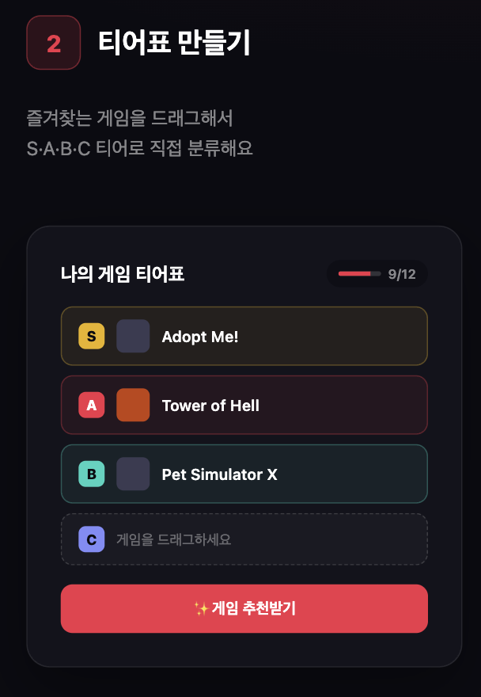
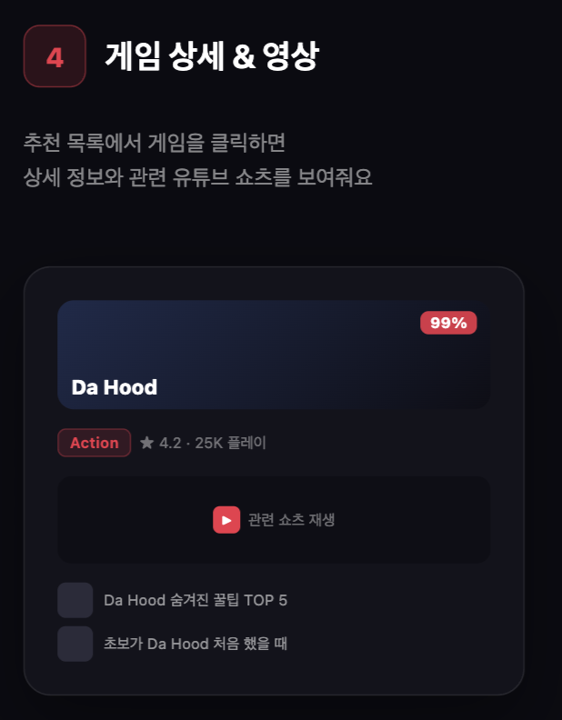
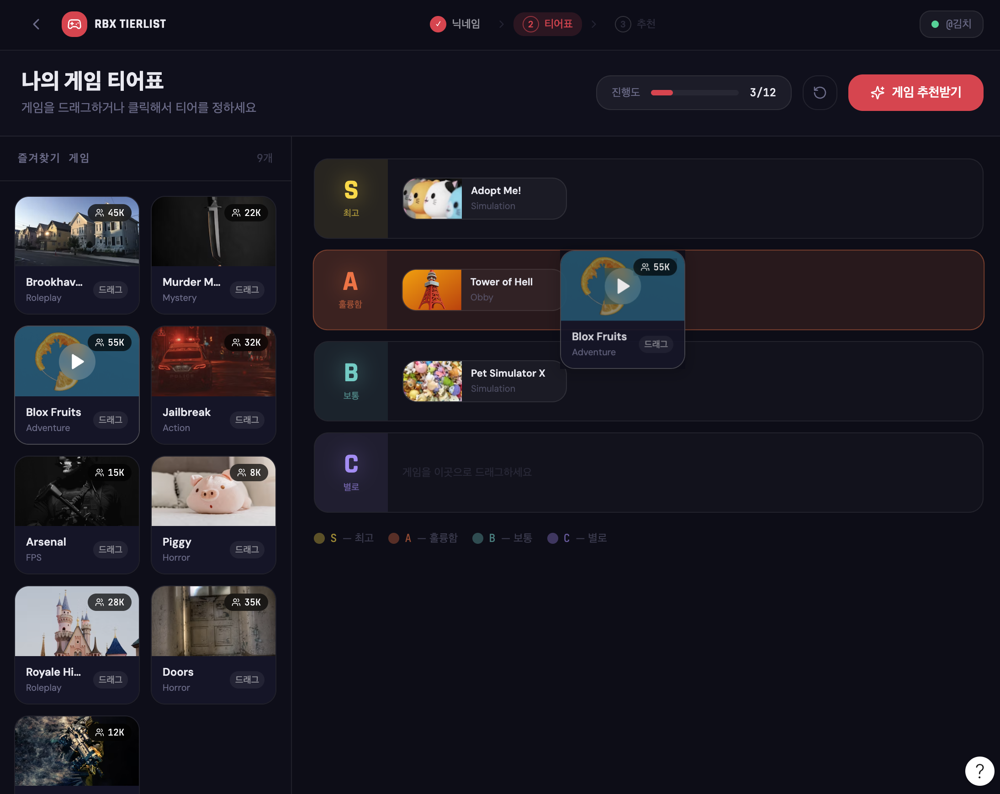
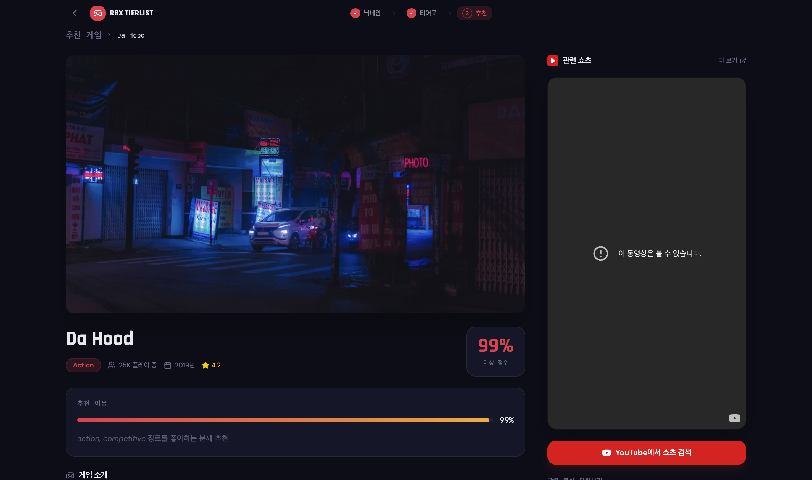
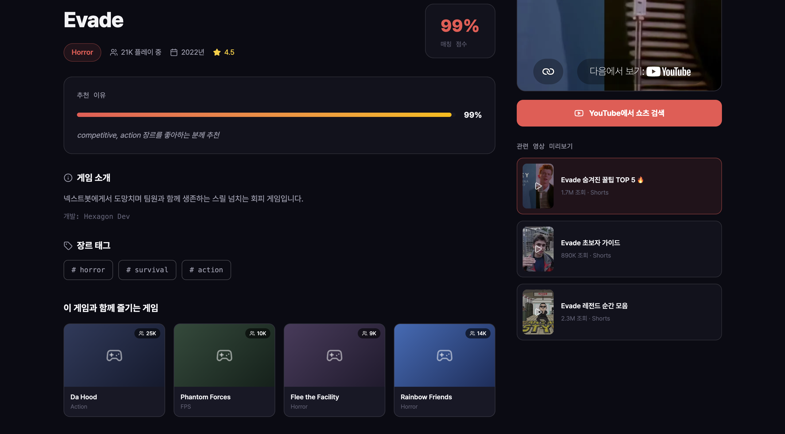

# 26s-w1-c3-09

## 공통과제 I : 웹 기반 프로젝트 (2인 1팀)

**목적:** 공통 과제를 함께 수행하며 웹 개발의 전체 흐름을 빠르게 익히고 협업에 적응하기

**결과물:** 기획부터 배포까지 완료된 웹 서비스와 관련 문서 일체

---

## 팀원

| 이름 | GitHub | 역할 |
|---|---|---|
| 박민수 | miinspp |  |
|김재훈| superloser030 |  |

---

## 기획안

> 프로젝트 주제, 목적, 핵심 기능, 예상 사용자, 팀원별 역할 등 정리

- **주제:** 로블록스 게임 추천
- **목적:** 유저의 선호를 바탕으로 손쉽게 다양한 게임을 추천
- **핵심 기능:** 게임 목록 파이프라이닝 및 추천
- **예상 사용자:** 로블록스에 가입된 유저

---

## 기능 명세서

> 구현할 기능을 사용자 관점에서 정리하고, 필수 기능과 선택 기능을 구분

### 📊 기능 목록 요약

| ID | 기능명 | 구분 | 담당자 | 상태 |
| :---: | :--- | :---: | :---: | :---: |
| **F-01** | 닉네임 입력 | 필수 |
| **F-02** | 즐겨찾기 불러오기 | 필수 |
| **F-03** | 티어 배치 | 필수 |
| **F-04** | 추천 생성 | 필수 |
| **F-05** | 추천 결과 카드 (장르별 구분) | 필수 |
| **F-06** | 게임 상세 보기 | 필수 |
| **F-10** | 게임 관련 유튜브 영상 (쇼츠형) | 선택 |
| **F-11** | 인기 게임 탐색 | 선택 |
| **F-12** | 추천 결과 공유 | 선택 |

---

### 🔍 필수 기능 상세 명세

<details>
<summary><b>💡 F-01. 닉네임 입력 (클릭하여 펼치기)</b></summary>
<div markdown="1" style="padding-left: 10px; margin-top: 10px;">

* **설명:** 사용자는 자신의 로블록스 닉네임을 입력하여 추천을 시작할 수 있다.
* **입력:** 로블록스 닉네임 (문자열)
* **처리:**
  * 입력한 닉네임을 로블록스 `userId`로 변환
  * 변환 성공 시 '즐겨찾기 불러오기(F-02)' 단계로 진행
* **예외 상황:**
  * 존재하지 않는 닉네임 $\rightarrow$ `"해당 닉네임의 유저를 찾을 수 없습니다"` 안내 문구 출력
  * 빈 값 입력 $\rightarrow$ 입력 필드에 에러 스타일 및 안내 표시
* **관련 화면:** 홈 / 시작 페이지 (`/`)
* **관련 API:** `POST` `https://users.roblox.com/v1/usernames/users` (외부 API)

</div>
</details>

<details>
<summary><b>💡 F-02. 즐겨찾기 불러오기 (클릭하여 펼치기)</b></summary>
<div markdown="1" style="padding-left: 10px; margin-top: 10px;">

* **설명:** 사용자는 입력한 닉네임의 즐겨찾기 게임 목록을 화면에서 확인할 수 있다.
* **입력:** 변환된 `userId` (F-01 결과)
* **처리:**
  * 해당 유저의 즐겨찾기 게임 목록 조회
  * 각 게임의 이름·썸네일과 함께 목록 표시
* **예외 상황:**
  * 즐겨찾기 비공개 또는 0개 $\rightarrow$ `"표시할 즐겨찾기가 없습니다. 인기 게임을 둘러보세요"` 안내 후 인기 게임 탐색(F-11)으로 유도
* **관련 화면:** 티어 배치 페이지 (`/tier`)
* **관련 API:** `GET` `https://games.roblox.com/v2/users/{userId}/favorite/games` (외부 API)

</div>
</details>

<details>
<summary><b>💡 F-03. 티어 배치 (클릭하여 펼치기)</b></summary>
<div markdown="1" style="padding-left: 10px; margin-top: 10px;">

* **설명:** 사용자는 불러온 즐겨찾기 게임들을 S/A/B/C/D 티어표에 드래그하여 선호도를 표현할 수 있다.
* **입력:** 게임 카드 드래그 앤 드롭 (게임 $\rightarrow$ 티어)
* **처리:**
  * S / A / B / C / D 5단계 티어표 제공
  * 게임 카드를 원하는 티어로 드래그하여 배치 기능
  * 배치하지 않은 게임은 "미분류"로 처리 (추천 시 제외 또는 낮은 가중치 부여)
  * 티어별 가중치 차등 부여 ($S=5$, $A=4$, $B=3$, $C=2$, $D=1$)
* **예외 상황:**
  * 아무 게임도 배치하지 않고 추천 요청 $\rightarrow$ `"게임을 하나 이상 배치해주세요"` 안내문 노출
* **관련 화면:** 티어 배치 페이지 (`/tier`)
* **관련 API:** 없음 (클라이언트 상태로 관리)

</div>
</details>

<details>
<summary><b>💡 F-04. 추천 생성 (클릭하여 펼치기)</b></summary>
<div markdown="1" style="padding-left: 10px; margin-top: 10px;">

* **설명:** 사용자는 티어 배치를 바탕으로 맞춤 추천 게임 목록을 생성할 수 있다.
* **입력:** 티어 배치 결과 (게임별 티어 데이터)
* **처리:**
  * 각 티어 게임의 연관 게임(cofavorite / 유사도) 조회
  * 후보별 점수 산출 규칙: $\sum(\text{티어 가중치} \times \text{연관 강도} \times \text{신뢰도})$
  * 유명도 보정 적용 (범용 인기작 편중 방지 알고리즘 반영)
  * 사용자가 이미 즐겨찾기한 게임은 추천 결과에서 제외
  * 최종 상위 $N$개의 추천 결과 반환
  * *※ 계산 로직 상세는 별도 "추천 알고리즘 설계 문서" 참고*
* **예외 상황:**
  * 연관 데이터 조회 실패 $\rightarrow$ 캐시 또는 폴백 데이터로 대체하며, 완전 실패 시 `"추천을 생성하지 못했습니다"` 안내문 노출
* **관련 화면:** 로딩화면 $\rightarrow$ 추천 결과 페이지 (`/result`)
* **관련 API:** `GET` `/api/recommend` (내부 API)

</div>
</details>

<details>
<summary><b>💡 F-05. 추천 결과 카드 (장르별 구분) (클릭하여 펼치기)</b></summary>
<div markdown="1" style="padding-left: 10px; margin-top: 10px;">

* **설명:** 사용자는 추천된 게임들을 썸네일·이름 카드로 확인하고, 장르별로 구분해서 볼 수 있다.
* **입력:** 없음 (F-04 추천 결과 데이터를 기반으로 표시)
* **처리:**
  * 추천 게임 목록을 [썸네일 + 게임 이름] 카드로 그리드(Grid) 형태 시각화
  * 게임 장르(genre) 기준으로 그룹핑 또는 필터링 기능 제공
  * 추천 카드 클릭 시 해당 게임 상세 보기(F-06) 모달/페이지로 이동
* **예외 상황:**
  * 조건에 맞는 추천 결과가 0개인 경우 $\rightarrow$ `"조건에 맞는 게임을 찾지 못했습니다"` 안내문 노출
* **관련 화면:** 추천 결과 페이지 (`/result`)
* **관련 API:** `GET` `/api/recommend` (내부 API), `https://thumbnails.roblox.com` (외부 API)

</div>
</details>

<details>
<summary><b>💡 F-06. 게임 상세 보기 (클릭하여 펼치기)</b></summary>
<div markdown="1" style="padding-left: 10px; margin-top: 10px;">

* **설명:** 사용자는 추천 카드를 눌러 해당 게임의 상세 정보를 확인할 수 있다.
* **입력:** 게임 선택 (`universeId`)
* **처리:**
  * 게임명, 설명, 장르, 현재 동시 접속자 수, 총 방문수, 좋아요 수 표시
  * 게임 대표 아이콘 및 스크린샷 이미지 렌더링
  * 해당 로블록스 게임 페이지로 즉시 이동할 수 있는 외부 바로가기 링크 제공
  * *(선택 기능 연계)* 우측 또는 하단 영역에 관련 유튜브 영상 패널 노출 (F-10)
* **예외 상황:**
  * 게임 정보 조회 실패 $\rightarrow$ `"게임 정보를 불러올 수 없습니다"` 안내문 노출
* **관련 화면:** 게임 상세 페이지 또는 모달 창 (`/game/:id`)
* **관련 API:** `GET` `/api/game/:id` (내부 API), `https://games.roblox.com/v1/games` 및 `https://thumbnails.roblox.com` (외부 API)

</div>
</details>

---

### 🔍 선택 기능 상세 명세 (필수 기능 완료 후 착수 여부 결정)

<details>
<summary><b>🎬 F-10. 게임 관련 유튜브 영상 (쇼츠형) (클릭하여 펼치기)</b></summary>
<div markdown="1" style="padding-left: 10px; margin-top: 10px;">

* **설명:** 사용자는 게임 상세 화면에서 해당 게임을 플레이하는 유튜브 영상을, 쇼츠처럼 위아래로 넘기며 쉽게 감상할 수 있다.
* **입력:** 게임명 (검색 키워드로 활용)
* **처리:**
  * 게임명을 조합하여 유튜브 관련 영상 검색 실행
  * 검색 결과를 세로 스와이프/넘김 UI(쇼츠 형태)로 순차 재생 환경 구축
  * 각 영상은 유튜브 임베드(Embed) 플레이어를 커스텀하여 재생
  * *※ API 할당량 절약을 위해 게임별 검색 결과를 서버 DB에 캐싱하여 재사용*
* **예외 상황:**
  * 관련 영상이 존재하지 않는 경우 $\rightarrow$ `"관련 영상을 찾지 못했습니다"` 안내 노출
  * YouTube API 할당량 초과 발생 $\rightarrow$ 기존에 캐시된 데이터 결과로 안전하게 대체
* **관련 화면:** 게임 상세 페이지 내 영상 패널 영역
* **관련 API:** YouTube Data API v3 `search.list` (외부 API, **서버 캐싱 필수**)
* **⚠️ 구현 제약 사항 및 인지 사항:**
  1. YouTube `search.list`는 호출당 100유닛이 차감되며, 무료 하루 총 한도는 10,000유닛이므로 **하루 검색이 약 100회로 매우 제한됨**. 따라서 게임별 검색 결과 캐싱이 절대적으로 필수임.
  2. 순수 "유튜브 쇼츠" 필터링은 공식 API가 명확히 지원하지 않음 $\rightarrow$ **일반 가로형 영상을 쇼츠처럼 넘겨볼 수 있는 UI 프레임**을 구현하는 방향으로 채택.
  3. 키워드 기반 검색 특성상 낚시성 등 무관한 영상이 일부 섞여 나올 수 있는 검색 품질 한계 인지 필요.

</div>
</details>

<details>
<summary><b>🌐 F-11. 인기 게임 탐색 (클릭하여 펼치기)</b></summary>
<div markdown="1" style="padding-left: 10px; margin-top: 10px;">

* **설명:** 사용자는 별도의 닉네임 입력 없이도 현재 로블록스의 트렌드 및 인기 게임 차트를 자유롭게 둘러볼 수 있다.
* **관련 API:** `https://apis.roblox.com/explore-api` (외부 차트 API)

</div>
</details>

<details>
<summary><b>🔗 F-12. 추천 결과 공유 (클릭하여 펼치기)</b></summary>
<div markdown="1" style="padding-left: 10px; margin-top: 10px;">

* **설명:** 사용자는 자신에게 매칭된 추천 결과를 스크린샷 이미지 저장 또는 고유 링크 형태로 복사하여 외부에 공유할 수 있다.

</div>
</details>

---

### 필수 기능

- [유저 닉네임 조회],
- [즐겨찾기 목록 표시],
- [게임 티어표 작성],
- [티어표 기반 추천 알고리즘 구성],
- [추천 목록 활성화]
- [게임 상세 정보 표시]

### 선택 기능

- [대화형으로 게임 추천]
- [게임 상세 페이지 속 또 다른 추천 목록 활성화]
- [SS, S, A, B, C, D로 티어계층을 더 세분화 & 가중치 차별화]


---

## IA 및 화면 설계서

> 서비스의 전체 페이지 구조와 페이지 간 이동 흐름; 각 페이지의 주요 UI 구성, 입력 요소, 버튼, 사용자 행동 흐름 등을 간단한 와이어프레임 형태로 정리

https://www.notion.so/392b0d7737b2803699c7f4e3c678de72?source=copy_link

<table border="0" align="center" cellspacing="0" cellpadding="0">
  <tr align="center" valign="middle">
    <td>
      <br>
      <span style="font-weight: bold; display: inline-block; margin-top: 10px;">닉네임으로 조회</span>
    </td>
    <td style="font-size: 24px; padding: 0 15px; font-weight: bold; color: #888;">➔</td>
    <td>
      <br>
      <span style="font-weight: bold; display: inline-block; margin-top: 10px;">티어표 작성하기</span>
    </td>
  </tr>
  <tr align="center">
    <td colspan="3" style="font-size: 24px; padding: 15px 0; font-weight: bold; color: #888;">⬇</td>
  </tr>
  <tr align="center" valign="middle">
    <td>
      <br>
      <span style="font-weight: bold; display: inline-block; margin-top: 10px;">맞춤 게임 추천</span>
    </td>
    <td style="font-size: 24px; padding: 0 15px; font-weight: bold; color: #888;">➔</td>
    <td>
      <br>
      <span style="font-weight: bold; display: inline-block; margin-top: 10px;">게임 설명 & 영상</span>
    </td>
  </tr>
</table>

---

- 전체 페이지 구조
<table border="0" align="center" width="100%">
  <tr align="center">
    <td colspan="2"></td>
    <td colspan="2"></td>
    <td colspan="2"></td>
  </tr>
  <tr align="center" style="font-weight: bold;">
    <td colspan="2">첫번째 페이지</td>
    <td colspan="2">두번째 페이지</td>
    <td colspan="2">세번째 페이지</td>
  </tr>
  <tr align="center">
    <td colspan="3"></td>
    <td colspan="3"></td>
  </tr>
  <tr align="center" style="font-weight: bold;">
    <td colspan="3">네번째 페이지 (1)</td>
    <td colspan="3">네번째 페이지 (2)</td>
  </tr>
</table>

<!-- Figma 링크 또는 이미지 첨부 -->

---

## DB 스키마

> 필요한 테이블, 주요 필드, 데이터 타입, 테이블 간 관계를 정리

<!-- ERD 이미지 또는 테이블 정의 -->

---

## API 문서

> API 주소, 요청 방식, 요청값, 응답값, 에러 상황을 정리

| Method | Endpoint | 설명 | 요청 | 응답 |
|---|---|---|---|---|
|  |  |  |  |  |

---

## 배포 결과물

> 접속 가능한 링크, 실행 방법, 주요 구현 내용

- **서비스 URL:**
- **실행 방법 (로컬 개발):**

```bash
# 0) 루트에 .env 생성 (.env.example 참고 — DB_PASSWORD 필수)

# 1) 로컬 MySQL (포트 3306): DB 생성 + 스키마 적용 (최초 1회 / 스키마 변경 시 재적용)
mysql -uroot -p -e "CREATE DATABASE IF NOT EXISTS roblox_rec CHARACTER SET utf8mb4"
mysql -uroot -p roblox_rec < docs/KJH/db-schema.sql

# 2) 서버 (Spring Boot, :8080) — 루트 .env 자동 로드
cd backend/server
./gradlew bootRun    # IntelliJ에서는 ServerApplication 그냥 Run 하면 됨

# 3) 배치 (Python) — 필요할 때 개별 실행
cd backend/batch
pip install -r requirements.txt
DB_PASSWORD=<비밀번호> python -m jobs.b1_charts

# 4) 프론트 (Vite dev server, :5173 — /api는 :8080으로 프록시됨)
cd frontend
npm install
npm run dev
```

---

## 회고 문서

> 개발 과정에서의 어려움, 해결 방법, 역할 분담, 다음에 개선할 점 (KPT 방법론 참고)

### Keep

### Problem

### Try

---

## 참고 자료

- [SDD(스펙 주도 개발) 이해하기](https://news.hada.io/topic?id=21338)
- [Software Design Document Best Practices](https://www.atlassian.com/work-management/project-management/design-document)
- [IA 정보구조도 작성 방법](https://brunch.co.kr/@nyonyo/7)
- [기획자 화면설계서 작성법](https://brunch.co.kr/@soup/10)
- [Figma 와이어프레임 가이드](https://www.figma.com/ko-kr/resource-library/what-is-wireframing/)
- [무료 Figma 와이어프레임 키트](https://www.figma.com/ko-kr/templates/wireframe-kits/)
- [ERD/DB 설계 총정리](https://inpa.tistory.com/entry/DB-%F0%9F%93%9A-%EB%8D%B0%EC%9D%B4%ED%84%B0-%EB%AA%A8%EB%8D%B8%EB%A7%81-%EA%B0%9C%EB%85%90-ERD-%EB%8B%A4%EC%9D%B4%EC%96%B4%EA%B7%B8%EB%9E%A8)
- [API 명세서 작성 가이드라인](https://velog.io/@sebinChu/BackEnd-API-%EB%AA%85%EC%84%B8%EC%84%9C-%EC%9E%91%EC%84%B1-%EA%B0%80%EC%9D%B4%EB%93%9C-%EB%9D%BC%EC%9D%B8)
- [좋은 README 작성하는 방법](https://velog.io/@sabo/good-readme)
- [단기 프로젝트 회고 KPT 방법론](https://velog.io/@habwa/%EB%8B%A8%EA%B8%B0-%ED%94%84%EB%A1%9C%EC%A0%9D%ED%8A%B8-%ED%9A%8C%EA%B3%A0-KPT-%EB%B0%A9%EB%B2%95%EB%A1%A0)