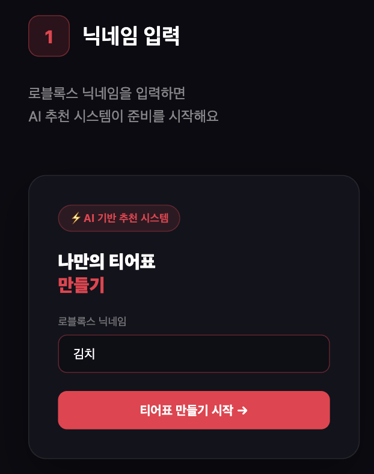
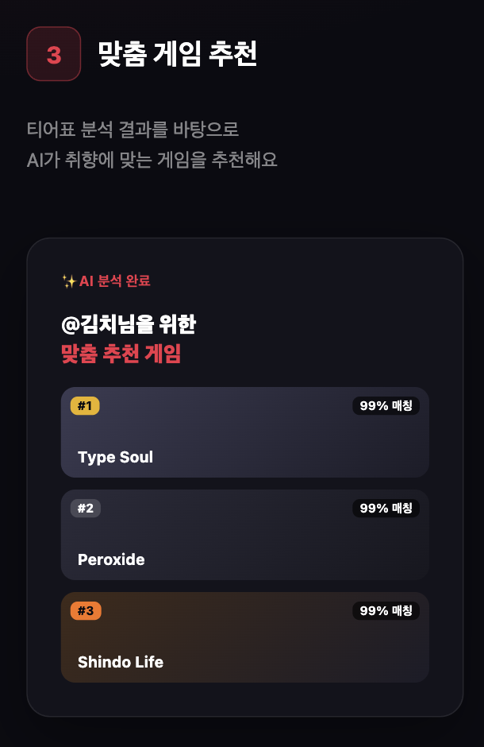
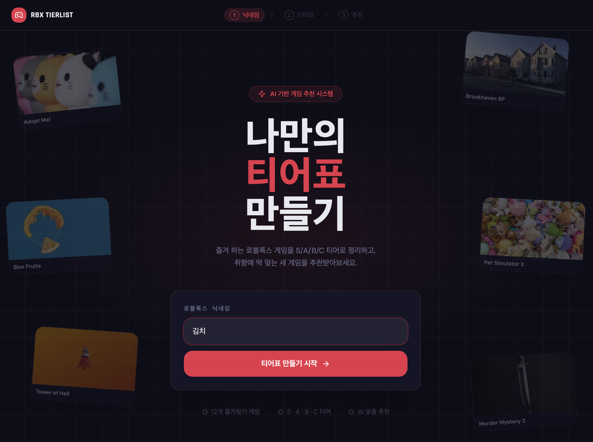
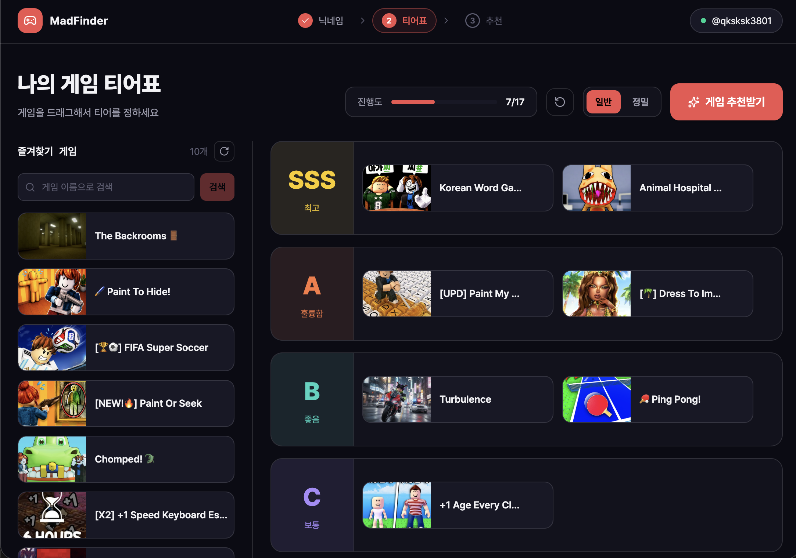
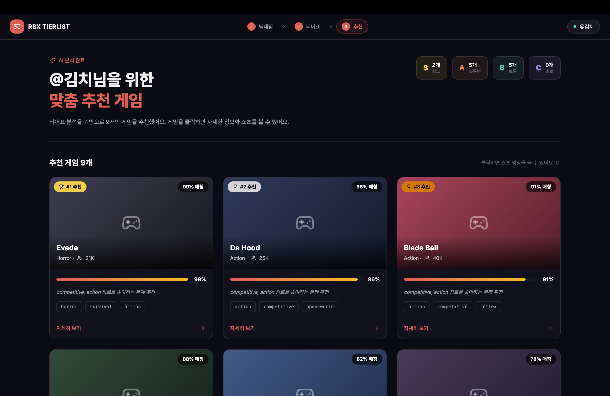
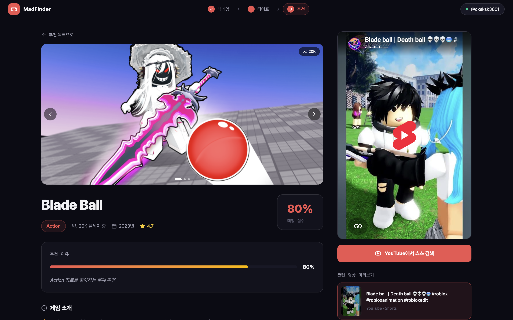
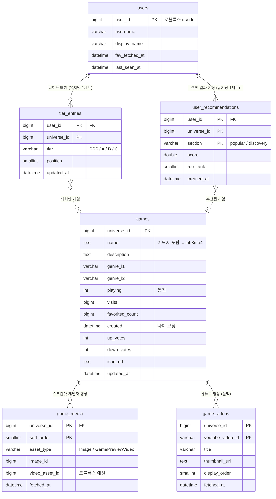
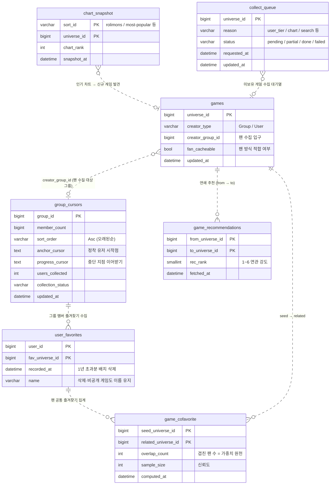

# 26s-w1-c3-09

## 공통과제 I : 웹 기반 프로젝트 (2인 1팀)

**목적:** 공통 과제를 함께 수행하며 웹 개발의 전체 흐름을 빠르게 익히고 협업에 적응하기

**결과물:** 기획부터 배포까지 완료된 웹 서비스와 관련 문서 일체

---

## 팀원

| 이름     | GitHub        | 역할                         |
|--------|---------------|----------------------------|
| 박민수    | miinspp       | 프론트, 백엔드, 배포               |
| 김재훈    | superloser030 | 프론트, 백엔드, 문서화, 데이터 수집 및 가공 |

---

## 기술 스택

| 영역 | 스택 |
|---|---|
| **프론트엔드** | React 19 · TypeScript 5.8 · Vite 7 · TanStack Query 5 (서버 상태) · Zustand 5 (클라이언트 상태) · Tailwind CSS 4 · dnd-kit (티어표 드래그) · MSW (API 목업) |
| **백엔드 (서버)** | Java 17 · Spring Boot 4.1 · Spring Data JPA (Hibernate) |
| **백엔드 (배치)** | Python 3 — 로블록스 데이터 24시간 상시 수집 루프 (차트→상세→그룹 팬 수집) |
| **DB** | MySQL 8.4 |
| **인프라** | Docker Compose (mysql·server·batch·frontend 4컨테이너) · nginx (정적 서빙 + `/api` 프록시 + HTTPS) · AWS EC2 · GitHub Actions (자동 배포) |

---

## 기획안

> 프로젝트 주제, 목적, 핵심 기능, 예상 사용자, 팀원별 역할 등 정리

- **주제:** 로블록스 게임 추천
- **목적:** 유저의 선호를 바탕으로 손쉽게 다양한 게임을 추천
- **핵심 기능:** 게임 목록 파이프라이닝 및 추천
- **예상 사용자:** 로블록스에 가입된 유저

---

## 기능 명세서

> 구현할 기능을 사용자 관점에서 정리하고, 필수 기능과 선택 기능을 구분

### 📊 기능 목록 요약

**필수 기능**

- [x] **F-01** 닉네임 입력
- [x] **F-02** 즐겨찾기 불러오기
- [x] **F-03** 티어 배치
- [x] **F-04** 추천 생성
- [x] **F-05** 추천 결과 카드 (장르별 구분)
- [x] **F-06** 게임 상세 보기

**선택 기능**

- [x] **F-10** 게임 관련 유튜브 영상 (쇼츠형)
- [ ] **F-11** 인기 게임 탐색
- [ ] **F-12** 추천 결과 공유

---

### 🔍 필수 기능 상세 명세

<details>
<summary><b>💡 F-01. 닉네임 입력 (클릭하여 펼치기)</b></summary>
<div markdown="1" style="padding-left: 10px; margin-top: 10px;">

* **설명:** 사용자는 자신의 로블록스 닉네임을 입력하여 추천을 시작할 수 있다.
* **입력:** 로블록스 닉네임 (문자열)
* **처리:**
  * 입력한 닉네임을 로블록스 `userId`로 변환
  * 변환 성공 시 '즐겨찾기 불러오기(F-02)' 단계로 진행
* **예외 상황:**
  * 존재하지 않는 닉네임 $\rightarrow$ `"해당 닉네임의 유저를 찾을 수 없습니다"` 안내 문구 출력
  * 빈 값 입력 $\rightarrow$ 입력 필드에 에러 스타일 및 안내 표시
* **관련 화면:** 홈 / 시작 페이지 (`/`)
* **관련 API:** `POST` `https://users.roblox.com/v1/usernames/users` (외부 API)

</div>
</details>

<details>
<summary><b>💡 F-02. 즐겨찾기 불러오기 (클릭하여 펼치기)</b></summary>
<div markdown="1" style="padding-left: 10px; margin-top: 10px;">

* **설명:** 사용자는 입력한 닉네임의 즐겨찾기 게임 목록을 화면에서 확인할 수 있다.
* **입력:** 변환된 `userId` (F-01 결과)
* **처리:**
  * 해당 유저의 즐겨찾기 게임 목록 조회
  * 각 게임의 이름·썸네일과 함께 목록 표시
* **예외 상황:**
  * 즐겨찾기 비공개 또는 0개 $\rightarrow$ `"표시할 즐겨찾기가 없습니다. 인기 게임을 둘러보세요"` 안내 후 인기 게임 탐색(F-11)으로 유도
* **관련 화면:** 티어 배치 페이지 (`/tier`)
* **관련 API:** `GET` `https://games.roblox.com/v2/users/{userId}/favorite/games` (외부 API)

</div>
</details>

<details>
<summary><b>💡 F-03. 티어 배치 (클릭하여 펼치기)</b></summary>
<div markdown="1" style="padding-left: 10px; margin-top: 10px;">

* **설명:** 사용자는 불러온 즐겨찾기 게임들을 SSS/A/B/C 티어표에 드래그하여 선호도를 표현할 수 있다.
* **입력:** 게임 카드 드래그 앤 드롭 (게임 $\rightarrow$ 티어)
* **처리:**
  * SSS / A / B / C 4단계 티어표 제공 (SSS는 "인생게임" 칸 — 최대 2개 배치 가능)
  * 게임 카드를 원하는 티어로 드래그하여 배치 기능
  * 배치하지 않은 게임은 "미분류"로 처리 (추천 시 제외 또는 낮은 가중치 부여)
  * 티어별 가중치 차등 부여 ($SSS=5.5$, $A=3$, $B=2$, $C=1$ — `backend/config/scoring.json` tierWeights)
* **예외 상황:**
  * 아무 게임도 배치하지 않고 추천 요청 $\rightarrow$ `"게임을 하나 이상 배치해주세요"` 안내문 노출
* **관련 화면:** 티어 배치 페이지 (`/tier`)
* **관련 API:** 없음 (클라이언트 상태로 관리)

</div>
</details>

<details>
<summary><b>💡 F-04. 추천 생성 (클릭하여 펼치기)</b></summary>
<div markdown="1" style="padding-left: 10px; margin-top: 10px;">

* **설명:** 사용자는 티어 배치를 바탕으로 맞춤 추천 게임 목록을 생성할 수 있다.
* **입력:** 티어 배치 결과 (게임별 티어 데이터)
* **처리:**
  * 각 티어 게임의 연관 게임(cofavorite / 유사도) 조회
  * 후보별 점수 산출 규칙: $\sum(\text{티어 가중치} \times \text{연관 강도} \times \text{신뢰도})$
  * 유명도 보정 적용 (범용 인기작 편중 방지 알고리즘 반영)
  * 사용자가 이미 즐겨찾기한 게임은 추천 결과에서 제외
  * 최종 상위 $N$개의 추천 결과 반환
  * *※ 계산 로직 상세는 별도 "추천 알고리즘 설계 문서" 참고*
* **예외 상황:**
  * 연관 데이터 조회 실패 $\rightarrow$ 캐시 또는 폴백 데이터로 대체하며, 완전 실패 시 `"추천을 생성하지 못했습니다"` 안내문 노출
* **관련 화면:** 로딩화면 $\rightarrow$ 추천 결과 페이지 (`/result`)
* **관련 API:** `GET` `/api/recommend` (내부 API)

</div>
</details>

<details>
<summary><b>💡 F-05. 추천 결과 카드 (장르별 구분) (클릭하여 펼치기)</b></summary>
<div markdown="1" style="padding-left: 10px; margin-top: 10px;">

* **설명:** 사용자는 추천된 게임들을 썸네일·이름 카드로 확인하고, 장르별로 구분해서 볼 수 있다.
* **입력:** 없음 (F-04 추천 결과 데이터를 기반으로 표시)
* **처리:**
  * 추천 게임 목록을 [썸네일 + 게임 이름] 카드로 그리드(Grid) 형태 시각화
  * 게임 장르(genre) 기준으로 그룹핑 또는 필터링 기능 제공
  * 추천 카드 클릭 시 해당 게임 상세 보기(F-06) 모달/페이지로 이동
* **예외 상황:**
  * 조건에 맞는 추천 결과가 0개인 경우 $\rightarrow$ `"조건에 맞는 게임을 찾지 못했습니다"` 안내문 노출
* **관련 화면:** 추천 결과 페이지 (`/result`)
* **관련 API:** `GET` `/api/recommend` (내부 API), `https://thumbnails.roblox.com` (외부 API)

</div>
</details>

<details>
<summary><b>💡 F-06. 게임 상세 보기 (클릭하여 펼치기)</b></summary>
<div markdown="1" style="padding-left: 10px; margin-top: 10px;">

* **설명:** 사용자는 추천 카드를 눌러 해당 게임의 상세 정보를 확인할 수 있다.
* **입력:** 게임 선택 (`universeId`)
* **처리:**
  * 게임명, 설명, 장르, 현재 동시 접속자 수, 총 방문수, 좋아요 수 표시
  * 게임 대표 아이콘 및 스크린샷 이미지 렌더링
  * 해당 로블록스 게임 페이지로 즉시 이동할 수 있는 외부 바로가기 링크 제공
  * *(선택 기능 연계)* 우측 또는 하단 영역에 관련 유튜브 영상 패널 노출 (F-10)
* **예외 상황:**
  * 게임 정보 조회 실패 $\rightarrow$ `"게임 정보를 불러올 수 없습니다"` 안내문 노출
* **관련 화면:** 게임 상세 페이지 또는 모달 창 (`/game/:id`)
* **관련 API:** `GET` `/api/game/:id` (내부 API), `https://games.roblox.com/v1/games` 및 `https://thumbnails.roblox.com` (외부 API)

</div>
</details>

---

### 🔍 선택 기능 상세 명세 (필수 기능 완료 후 착수 여부 결정)

<details>
<summary><b>🎬 F-10. 게임 관련 유튜브 영상 (쇼츠형) (클릭하여 펼치기)</b></summary>
<div markdown="1" style="padding-left: 10px; margin-top: 10px;">

* **설명:** 사용자는 게임 상세 화면에서 해당 게임을 플레이하는 유튜브 영상을, 쇼츠처럼 위아래로 넘기며 쉽게 감상할 수 있다.
* **입력:** 게임명 (검색 키워드로 활용)
* **처리:**
  * 게임명을 조합하여 유튜브 관련 영상 검색 실행
  * 검색 결과를 세로 스와이프/넘김 UI(쇼츠 형태)로 순차 재생 환경 구축
  * 각 영상은 유튜브 임베드(Embed) 플레이어를 커스텀하여 재생
  * *※ API 할당량 절약을 위해 게임별 검색 결과를 서버 DB에 캐싱하여 재사용*
* **예외 상황:**
  * 관련 영상이 존재하지 않는 경우 $\rightarrow$ `"관련 영상을 찾지 못했습니다"` 안내 노출
  * YouTube API 할당량 초과 발생 $\rightarrow$ 기존에 캐시된 데이터 결과로 안전하게 대체
* **관련 화면:** 게임 상세 페이지 내 영상 패널 영역
* **관련 API:** YouTube Data API v3 `search.list` (외부 API, **서버 캐싱 필수**)
* **⚠️ 구현 제약 사항 및 인지 사항:**
  1. YouTube `search.list`는 호출당 100유닛이 차감되며, 무료 하루 총 한도는 10,000유닛이므로 **하루 검색이 약 100회로 매우 제한됨**. 따라서 게임별 검색 결과 캐싱이 절대적으로 필수임.
  2. 순수 "유튜브 쇼츠" 필터링은 공식 API가 명확히 지원하지 않음 $\rightarrow$ **일반 가로형 영상을 쇼츠처럼 넘겨볼 수 있는 UI 프레임**을 구현하는 방향으로 채택.
  3. 키워드 기반 검색 특성상 낚시성 등 무관한 영상이 일부 섞여 나올 수 있는 검색 품질 한계 인지 필요.

</div>
</details>

<details>
<summary><b>🌐 F-11. 인기 게임 탐색 (클릭하여 펼치기)</b></summary>
<div markdown="1" style="padding-left: 10px; margin-top: 10px;">

* **설명:** 사용자는 별도의 닉네임 입력 없이도 현재 로블록스의 트렌드 및 인기 게임 차트를 자유롭게 둘러볼 수 있다.
* **관련 API:** `https://apis.roblox.com/explore-api` (외부 차트 API)

</div>
</details>

<details>
<summary><b>🔗 F-12. 추천 결과 공유 (클릭하여 펼치기)</b></summary>
<div markdown="1" style="padding-left: 10px; margin-top: 10px;">

* **설명:** 사용자는 자신에게 매칭된 추천 결과를 스크린샷 이미지 저장 또는 고유 링크 형태로 복사하여 외부에 공유할 수 있다.

</div>
</details>

---

## IA 및 화면 설계서

> 서비스의 전체 페이지 구조와 페이지 간 이동 흐름; 각 페이지의 주요 UI 구성, 입력 요소, 버튼, 사용자 행동 흐름 등을 간단한 와이어프레임 형태로 정리

https://www.notion.so/392b0d7737b2803699c7f4e3c678de72?source=copy_link

<table border="0" align="center" cellspacing="0" cellpadding="0">
  <tr align="center" valign="middle">
    <td>
      <br>
      <span style="font-weight: bold; display: inline-block; margin-top: 10px;">닉네임으로 조회</span>
    </td>
    <td style="font-size: 24px; padding: 0 15px; font-weight: bold; color: #888;">➔</td>
    <td>
      <br>
      <span style="font-weight: bold; display: inline-block; margin-top: 10px;">티어표 작성하기</span>
    </td>
  </tr>
  <tr align="center">
    <td colspan="3" style="font-size: 24px; padding: 15px 0; font-weight: bold; color: #888;">⬇</td>
  </tr>
  <tr align="center" valign="middle">
    <td>
      <br>
      <span style="font-weight: bold; display: inline-block; margin-top: 10px;">맞춤 게임 추천</span>
    </td>
    <td style="font-size: 24px; padding: 0 15px; font-weight: bold; color: #888;">➔</td>
    <td>
      <br>
      <span style="font-weight: bold; display: inline-block; margin-top: 10px;">게임 설명 & 영상</span>
    </td>
  </tr>
</table>

---

- 전체 페이지 구조
<table border="0" align="center" width="100%">
  <tr align="center">
    <td colspan="2"></td>
    <td colspan="2"></td>
    <td colspan="2"></td>
  </tr>
  <tr align="center" style="font-weight: bold;">
    <td colspan="2">첫번째 페이지</td>
    <td colspan="2">두번째 페이지</td>
    <td colspan="2">세번째 페이지</td>
  </tr>
  <tr align="center">
    <td colspan="3"></td>
    <td colspan="3"></td>
  </tr>
  <tr align="center" style="font-weight: bold;">
    <td colspan="3">네번째 페이지 (1)</td>
    <td colspan="3">네번째 페이지 (2)</td>
  </tr>
</table>

<!-- Figma 링크 또는 이미지 첨부 -->

---

## DB 스키마

> 총 13개 테이블. 전체 DDL(타입 실측 근거·주석 포함)은 [docs/schema/db-schema.sql](docs/schema/db-schema.sql) 참고.
> ERD 범례: **실선 = FK 제약**, **점선 = 논리적 참조**(FK 없음 — 아직 수집되지 않은 게임을 참조할 수 있어 의도적으로 제약을 뺌).

두 갈래로 나눠 이해하면 쉽다. **사용자가 화면에서 직접 만드는 데이터(핵심 흐름)** 와, **배치가 뒤에서 게임 풀·추천 재료를 채우는 데이터(수집 인프라)**. 두 갈래는 중심 테이블 `games`에서 만난다 — 배치가 채워 넣고, 사용자 화면이 꺼내 쓴다.

<br>

### 🟦 핵심 흐름 — 사용자 요청이 지나가는 경로

> 닉네임으로 들어온 유저가 **티어표(`tier_entries`)를 배치** → 추천 계산 결과가 **`user_recommendations`에 저장** → 화면은 `games`의 메타데이터와 상세 페이지의 `game_media`·`game_videos`로 그려진다. 유저당 티어표·추천은 각 1세트만 두고 덮어쓴다.



<br>

### 🟩 수집 인프라 — 배치가 게임 풀·추천 재료를 채우는 파이프라인

> **인기 차트(`chart_snapshot`)** 와 유저 활동에서 새 게임을 발견 → **`collect_queue`에 쌓아** 배치가 `games`를 채운다. 게임의 제작 그룹(`creator_group_id`)을 입구로 **팬 유저의 즐겨찾기(`user_favorites`)를 수집**(`group_cursors`가 진행 상황을 이어받기) → 이를 집계한 **`game_cofavorite`(팬 공통 즐겨찾기)** 와 **`game_recommendations`(연쇄 추천)** 이 추천 알고리즘의 재료가 된다.



> 위 두 그림에 없는 **`system_heartbeat`** 는 관계가 없는 독립 테이블 — 서버가 정밀 추천을 도는 동안 배치와 로블록스 호출 예산을 나눠 쓰도록 조율하는 런타임 신호(TTL 1행)다.

---

## API 명세

### 우리 백엔드 API (프론트 ↔ 서버)

Base URL(로컬): `http://localhost:8080` · 응답은 전부 JSON · 에러 공통 형식: `{ "error": 코드, "message": 설명 }`

| Method | Endpoint | 설명 | 요청 | 응답 |
|---|---|---|---|---|
| GET | `/api/health` | 서버 생존 확인 | 없음 | `status` |
| GET | `/api/users/{username}/favorites` | 닉네임으로 유저 확인 + 즐겨찾기 + 저장된 티어표 (1페이지). 캐시 우선, `refresh=true`면 로블록스 재조회 | Path: `username` · Query: `refresh` (선택, 기본 false) | `userId`, `username`, `favorites[]`(`universeId`, `name`, `iconUrl`), `favoritesEmpty`, `savedTier[]`(`universeId`, `tier`, `position`) \| `null` |
| GET | `/api/search` | 게임 이름 검색 (티어표 직접 추가용, 2페이지). 로블록스 omni-search 실시간 호출, 같은 검색어는 서버 캐시로 응답 | Query: `q` | `results[]`(`universeId`, `name`, `playerCount`, `iconUrl`) 상위 10개 |
| PUT | `/api/tiers` | 티어표 저장 — 유저당 1세트 전체 덮어쓰기 (2페이지). tier ∈ SSS/A/B/C, SSS 최대 2개 | Body: `userId`, `entries[]`(`universeId`, `tier`, `position`) | `ok`, `saved` |
| POST | `/api/recommend` | 추천 계산 실행 (2→3페이지). 티어 가중 합산 + 유명도·나이 보정, 결과 저장 후 반환. `precise=true`면 정밀 분석 잡 시작(즉시 `jobId` 반환, 아래 status로 폴링) | Body: `userId`, `precise` (선택, 기본 false) | `sections`(`popular[]`, `discovery[]` — 섹션당 50개, 항목: `rank`, `universeId`, `name`, `genreL1`, `genreL2`, `score`, `playerCount`, `iconUrl`) · precise면 `jobId`, `status` |
| GET | `/api/recommend/status/{jobId}` | 정밀 분석 진행 상태 폴링. running: `progress`만 / finalizing: `message` / done: `sections` / error: `message` | Path: `jobId` | `status`, `progress`(`current`, `total`, `collectingName`, `percent`), `sections`, `message` |
| POST | `/api/recommend/cancel/{jobId}` | 정밀 분석 중단 — 지금까지 수집한 것만으로 추천 계산 | Path: `jobId` | `status` |
| GET | `/api/recommendations/{userId}` | 마지막 추천 결과 재조회 (재계산 없음, 뒤로가기·재방문 복원용) | Path: `userId` | POST /api/recommend 와 동일한 `sections` 형태. 없으면 두 리스트 다 `[]` |
| GET | `/api/games/{universeId}` | 게임 상세 (4페이지) | Path: `universeId` | `universeId`, `name`, `description`, `genreL1`, `genreL2`, `playing`, `visits`, `upVotes`, `downVotes`, `minimumAge`, `screenshots[]`, `videoUrl`, `robloxUrl` |
| GET | `/api/games/{universeId}/videos` | 유튜브 영상 목록 (4페이지 폴백). 재생은 `youtube.com/embed/{id}` | Path: `universeId` | `videos[]`(`youtubeVideoId`, `title`, `thumbnailUrl`) |
| GET | `/api/games/{universeId}/similar` | 함께 즐겨찾기된 게임 상위 목록 (4페이지 "비슷한 게임") | Path: `universeId` | `similar[]`(`universeId`, `name`, `genreL1`, `playerCount`, `iconUrl`) 최대 6개 |

### 에러 코드

| 상태코드 | error 코드 | 발생 상황 |
|---|---|---|
| 404 | `USER_NOT_FOUND` | 존재하지 않는 로블록스 닉네임 |
| 400 | `INVALID_TIER` / `SSS_LIMIT` / `EMPTY_TIER` | 티어 값 오류 / SSS 3개 이상 / entries 빈 배열 |
| 404 | `NO_TIER` | 티어표 없는 유저의 추천 요청 |
| 404 | `GAME_NOT_FOUND` | DB에 없는 universeId (수집 전 게임 포함) |
| 429 | `BUSY` | 로블록스 호출 예산 소진 또는 로블록스 rate limit 쿨다운 (메시지에 남은 시간 안내) |
| 502 | `ROBLOX_ERROR` | 로블록스 API 실패 |
| 500 | `INTERNAL` | 그 외 서버 오류 |

### 외부 API — 로블록스 (server 실시간 호출)

| Method | Endpoint | 설명 | 요청 | 응답 |
|---|---|---|---|---|
| POST | `users.roblox.com/v1/usernames/users` | 닉네임 → userId 해석 (배치 100개) | `usernames[]` | `data[]`(`id`, `name`) |
| GET | `games.roblox.com/v2/users/{userId}/favorite/games` | 유저 즐겨찾기 목록 (유저당 1호출, limit 50) | Path: `userId` | `data[]`(`id`, `name`, ...) |

### 외부 API — 로블록스 (batch 수집 호출)

| Method | Endpoint | 설명 | 요청 | 응답 |
|---|---|---|---|---|
| GET | `apis.roblox.com/explore-api/v1/get-sorts` | 인기 차트 종류 목록 (b1) | `sessionId`, `sortsPageToken` | `sorts[]`(`sortId`), `nextSortsPageToken` |
| GET | `apis.roblox.com/explore-api/v1/get-sort-content` | 차트별 게임 목록 (b1) | `sessionId`, `sortId` | `games[]`(`universeId`, ...) |
| GET | `games.roblox.com/v1/games?universeIds=` | 게임 상세 — 이름·장르·동접·방문수·생성일·제작그룹 (b2, 50개 묶음) | `universeIds` (≤50) | `data[]`(`id`, `rootPlaceId`, `name`, `description`, `playing`, `visits`, `favoritedCount`, `created`, `creator`, ...) |
| GET | `games.roblox.com/v1/games/votes?universeIds=` | 좋아요/싫어요 (b2, 100개 묶음) | `universeIds` (≤100) | `data[]`(`id`, `upVotes`, `downVotes`) |
| GET | `thumbnails.roblox.com/v1/games/icons?universeIds=` | 게임 아이콘 URL (b2, 100개 묶음) | `universeIds` (≤100), `size`, `format` | `data[]`(`targetId`, `state`, `imageUrl`) |
| GET | `groups.roblox.com/v1/groups/{groupId}/users` | 그룹 멤버 목록 — 오래된 가입순 페이지 순회 (b4, 페이지당 100명) | Path: `groupId` · Query: `limit=100`, `sortOrder=Asc`, `cursor` | `data[]`(`user.userId`), `nextPageCursor` |
| GET | `games.roblox.com/v2/users/{userId}/favorite/games` | 그룹 멤버의 즐겨찾기 수집 (b4, limit 50) | Path: `userId` | `data[]`(`id`) |

> 전체 로블록스 엔드포인트 인벤토리·호출 예산(rate)·배치 상한 실측값은 `backend/config/rate_governance.json` 참고.
> `rate_governance.json`에는 위 외에 `games_rec`(연쇄추천) · `games_media`(스크린샷) · `groups_info`(그룹 정보) · `apis_place`(place→universe 변환) · `thumb_thumbnail`(썸네일) 버킷도 정의되어 있음. `apis_search`(omni-search)는 GET /api/search가 소비.

### 외부 API — 유튜브

| Method | Endpoint | 설명 | 요청 | 응답 |
|---|---|---|---|---|
| GET | `www.googleapis.com/youtube/v3/search` | 게임 이름으로 유튜브 영상 검색 → `game_videos` 캐시 (`/api/games/{id}/videos`의 원천) | `part=snippet`, `q`, `type=video`, `key`(API 키) | `items[]`(`id.videoId`, `snippet.title`, `snippet.thumbnails`) |

---

## 배포 결과물

> 접속 가능한 링크, 실행 방법, 주요 구현 내용

- **서비스 URL:** https://madfinder.site
- **배포 파이프라인 (자동):** `main`에 push(=PR 머지)되면 GitHub Actions([deploy.yml](.github/workflows/deploy.yml))가 EC2에 ssh 접속 → `git reset --hard origin/main` → `docker compose -f docker-compose-prod.yml up -d --build`로 전체 스택 재기동 → health check(`/api/health` 200 + http→https 308 리다이렉트)까지 확인. 별도 수동 배포 절차 없음
- **실행 방법 (프로덕션/EC2):**

```bash
# 루트에 .env 생성 (DB_PASSWORD 필수) 후
docker compose -f docker-compose-prod.yml up -d --build
```

- **실행 방법 (로컬 개발):**

```bash
# 0) 루트에 .env 생성 (.env.example 참고 — DB_PASSWORD 필수)

# 1) 로컬 MySQL (포트 3306): DB 생성 + 스키마 적용 (최초 1회 / 스키마 변경 시 재적용)
mysql -uroot -p -e "CREATE DATABASE IF NOT EXISTS roblox_rec CHARACTER SET utf8mb4"
mysql -uroot -p roblox_rec < docs/schema/db-schema.sql

# 2) 서버 (Spring Boot, :8080) — 루트 .env 자동 로드
cd backend/server
./gradlew bootRun    # IntelliJ에서는 ServerApplication 그냥 Run 하면 됨

# 3) 배치 (Python) — 필요할 때 개별 실행
cd backend/batch
pip install -r requirements.txt
DB_PASSWORD=<비밀번호> python -m jobs.b1_charts

# 4) 프론트 (Vite dev server, :5173 — /api는 :8080으로 프록시됨)
cd frontend
npm install
npm run dev
```

---

## 회고 문서

> 개발 과정에서의 어려움, 해결 방법, 역할 분담, 다음에 개선할 점 (KPT 방법론 참고)

### Keep

### Problem

### Try

---

## 참고 자료

- [SDD(스펙 주도 개발) 이해하기](https://news.hada.io/topic?id=21338)
- [Software Design Document Best Practices](https://www.atlassian.com/work-management/project-management/design-document)
- [IA 정보구조도 작성 방법](https://brunch.co.kr/@nyonyo/7)
- [기획자 화면설계서 작성법](https://brunch.co.kr/@soup/10)
- [Figma 와이어프레임 가이드](https://www.figma.com/ko-kr/resource-library/what-is-wireframing/)
- [무료 Figma 와이어프레임 키트](https://www.figma.com/ko-kr/templates/wireframe-kits/)
- [ERD/DB 설계 총정리](https://inpa.tistory.com/entry/DB-%F0%9F%93%9A-%EB%8D%B0%EC%9D%B4%ED%84%B0-%EB%AA%A8%EB%8D%B8%EB%A7%81-%EA%B0%9C%EB%85%90-ERD-%EB%8B%A4%EC%9D%B4%EC%96%B4%EA%B7%B8%EB%9E%A8)
- [API 명세서 작성 가이드라인](https://velog.io/@sebinChu/BackEnd-API-%EB%AA%85%EC%84%B8%EC%84%9C-%EC%9E%91%EC%84%B1-%EA%B0%80%EC%9D%B4%EB%93%9C-%EB%9D%BC%EC%9D%B8)
- [좋은 README 작성하는 방법](https://velog.io/@sabo/good-readme)
- [단기 프로젝트 회고 KPT 방법론](https://velog.io/@habwa/%EB%8B%A8%EA%B8%B0-%ED%94%84%EB%A1%9C%EC%A0%9D%ED%8A%B8-%ED%9A%8C%EA%B3%A0-KPT-%EB%B0%A9%EB%B2%95%EB%A1%A0)